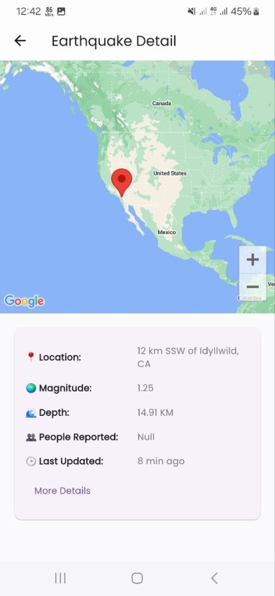

# Earthquake Mapper

Earthquake Mapper is a Flutter application designed to visualize recent earthquake data from an online earthquake API. The app allows users to explore earthquakes on a map, filter them by time, and view detailed information about each earthquake event.

## Screenshots

Here are some screenshots of the Earthquake Mapper app:

